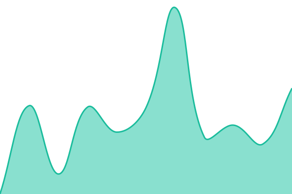
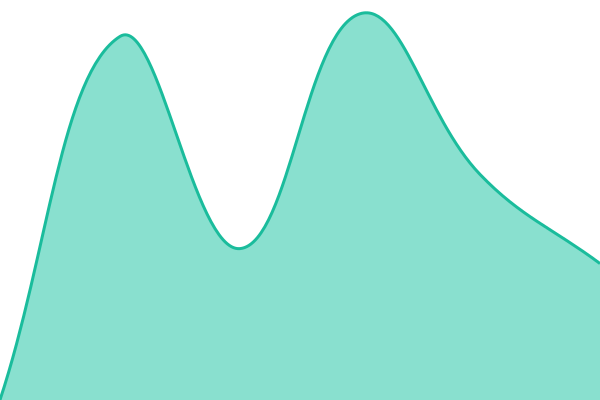
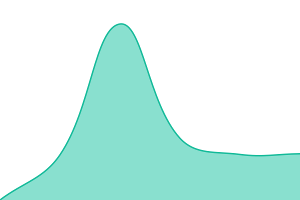

# [📈 Live Status](https://laksithaudayanga1110.github.io/dtech-web-monitoring): <!--live status--> **🟧 Partial outage**

This repository contains the open-source uptime monitor and status page for [laksithaudayanga1110](https://laksithaudayanga1110.github.io/dtech-web-monitoring), powered by [Upptime](https://github.com/upptime/upptime).

With [Upptime](https://upptime.js.org), you can get your own unlimited and free uptime monitor and status page, powered entirely by a GitHub repository. We use [Issues](https://github.com/laksithaudayanga1110/dtech-web-monitoring/issues) as incident reports, [Actions](https://github.com/laksithaudayanga1110/dtech-web-monitoring/actions) as uptime monitors, and [Pages](https://laksithaudayanga1110.github.io/dtech-web-monitoring) for the status page.

<!--start: status pages-->
<!-- This summary is generated by Upptime (https://github.com/upptime/upptime) -->
<!-- Do not edit this manually, your changes will be overwritten -->
<!-- prettier-ignore -->
| URL | Status | History | Response Time | Uptime |
| --- | ------ | ------- | ------------- | ------ |
|  [DSS](https://luckson-battery.turnon.lk/) | 🟩 Up | [dss.yml](https://github.com/laksithaudayanga1110/dtech-web-monitoring/commits/HEAD/history/dss.yml) | 

 1594ms
     
 | 

<a href="https://laksithaudayanga1110.github.io/dtech-web-monitoring/history/dss">99.99%</a>
    

|  [DSI](http://dsi.lk/) | 🟩 Up | [dsi.yml](https://github.com/laksithaudayanga1110/dtech-web-monitoring/commits/HEAD/history/dsi.yml) | 

 2682ms
     
 | 

<a href="https://laksithaudayanga1110.github.io/dtech-web-monitoring/history/dsi">100.00%</a>
    

|  [DTech LK](http://dtech.lk/) | 🟩 Up | [d-tech-lk.yml](https://github.com/laksithaudayanga1110/dtech-web-monitoring/commits/HEAD/history/d-tech-lk.yml) | 

 3379ms
     
 | 

<a href="https://laksithaudayanga1110.github.io/dtech-web-monitoring/history/d-tech-lk">100.00%</a>
    

|  [DTech COM](http://dtechlk.com) | 🟩 Up | [d-tech-com.yml](https://github.com/laksithaudayanga1110/dtech-web-monitoring/commits/HEAD/history/d-tech-com.yml) | 

 1030ms
     
 | 

<a href="https://laksithaudayanga1110.github.io/dtech-web-monitoring/history/d-tech-com">100.00%</a>
    

|  [DSS](http://www.dss.lk/) | 🟩 Up | [dss.yml](https://github.com/laksithaudayanga1110/dtech-web-monitoring/commits/HEAD/history/dss.yml) | 

 1594ms
     
 | 

<a href="https://laksithaudayanga1110.github.io/dtech-web-monitoring/history/dss">99.99%</a>
    

|  [Samtessi Brush](http://samtessibrush.lk/) | 🟩 Up | [samtessi-brush.yml](https://github.com/laksithaudayanga1110/dtech-web-monitoring/commits/HEAD/history/samtessi-brush.yml) | 

 3583ms
     
 | 

<a href="https://laksithaudayanga1110.github.io/dtech-web-monitoring/history/samtessi-brush">100.00%</a>
    

|  [Lanka Brush](http://lankabrush.com/) | 🟩 Up | [lanka-brush.yml](https://github.com/laksithaudayanga1110/dtech-web-monitoring/commits/HEAD/history/lanka-brush.yml) | 

 291ms
     
 | 

<a href="https://laksithaudayanga1110.github.io/dtech-web-monitoring/history/lanka-brush">100.00%</a>
    

|  [SML Footwear](https://smlfootwear.com/) | 🟩 Up | [sml-footwear.yml](https://github.com/laksithaudayanga1110/dtech-web-monitoring/commits/HEAD/history/sml-footwear.yml) | 

 889ms
     
 | 

<a href="https://laksithaudayanga1110.github.io/dtech-web-monitoring/history/sml-footwear">100.00%</a>
    

|  [Primo LK](http://www.primolk.com/) | 🟩 Up | [primo-lk.yml](https://github.com/laksithaudayanga1110/dtech-web-monitoring/commits/HEAD/history/primo-lk.yml) | 

 460ms
     
 | 

<a href="https://laksithaudayanga1110.github.io/dtech-web-monitoring/history/primo-lk">100.00%</a>
    

|  [Grant Tech Holdings](http://granttechholdings.com/) | 🟩 Up | [grant-tech-holdings.yml](https://github.com/laksithaudayanga1110/dtech-web-monitoring/commits/HEAD/history/grant-tech-holdings.yml) | 

 1278ms
     
 | 

<a href="https://laksithaudayanga1110.github.io/dtech-web-monitoring/history/grant-tech-holdings">100.00%</a>
    

|  [Grace LK](http://gracelk.com/) | 🟩 Up | [grace-lk.yml](https://github.com/laksithaudayanga1110/dtech-web-monitoring/commits/HEAD/history/grace-lk.yml) | 

 20846ms
     
 | 

<a href="https://laksithaudayanga1110.github.io/dtech-web-monitoring/history/grace-lk">100.00%</a>
    

|  [BNB Furnitures](https://bnbfurnitureslk.com/) | 🟩 Up | [bnb-furnitures.yml](https://github.com/laksithaudayanga1110/dtech-web-monitoring/commits/HEAD/history/bnb-furnitures.yml) | 

 1958ms
     
 | 

<a href="https://laksithaudayanga1110.github.io/dtech-web-monitoring/history/bnb-furnitures">100.00%</a>
    

|  [Sheet Piling Sri Lanka](http://sheetpilingsrilanka.com/) | 🟩 Up | [sheet-piling-sri-lanka.yml](https://github.com/laksithaudayanga1110/dtech-web-monitoring/commits/HEAD/history/sheet-piling-sri-lanka.yml) | 

 1497ms
     
 | 

<a href="https://laksithaudayanga1110.github.io/dtech-web-monitoring/history/sheet-piling-sri-lanka">100.00%</a>
    

|  [Rajendra Trading](http://rajendratrading.com/) | 🟩 Up | [rajendra-trading.yml](https://github.com/laksithaudayanga1110/dtech-web-monitoring/commits/HEAD/history/rajendra-trading.yml) | 

 18858ms
     
 | 

<a href="https://laksithaudayanga1110.github.io/dtech-web-monitoring/history/rajendra-trading">100.00%</a>
    

|  [Hummingbird Holiday](http://hummingbirdholiday.com/) | 🟩 Up | [hummingbird-holiday.yml](https://github.com/laksithaudayanga1110/dtech-web-monitoring/commits/HEAD/history/hummingbird-holiday.yml) | 

 536ms
     
 | 

<a href="https://laksithaudayanga1110.github.io/dtech-web-monitoring/history/hummingbird-holiday">100.00%</a>
    

|  [Hummingbird LK](http://hummingbird.lk/) | 🟥 Down | [hummingbird-lk.yml](https://github.com/laksithaudayanga1110/dtech-web-monitoring/commits/HEAD/history/hummingbird-lk.yml) | 

 0ms
     
 | 

<a href="https://laksithaudayanga1110.github.io/dtech-web-monitoring/history/hummingbird-lk">99.55%</a>
    

|  [Ursidekick](http://ursidekick.com/) | 🟩 Up | [ursidekick.yml](https://github.com/laksithaudayanga1110/dtech-web-monitoring/commits/HEAD/history/ursidekick.yml) | 

 2361ms
     
 | 

<a href="https://laksithaudayanga1110.github.io/dtech-web-monitoring/history/ursidekick">100.00%</a>
    

|  [Vandanaa](http://vandanaa.lk/) | 🟩 Up | [vandanaa.yml](https://github.com/laksithaudayanga1110/dtech-web-monitoring/commits/HEAD/history/vandanaa.yml) | 

 1876ms
     
 | 

<a href="https://laksithaudayanga1110.github.io/dtech-web-monitoring/history/vandanaa">100.00%</a>
    

|  [Zynolo LK](http://zynolo.lk/) | 🟥 Down | [zynolo-lk.yml](https://github.com/laksithaudayanga1110/dtech-web-monitoring/commits/HEAD/history/zynolo-lk.yml) | 

 0ms
     
 | 

<a href="https://laksithaudayanga1110.github.io/dtech-web-monitoring/history/zynolo-lk">99.76%</a>
    

|  [Zynolo COM](http://zynolo.com/) | 🟩 Up | [zynolo-com.yml](https://github.com/laksithaudayanga1110/dtech-web-monitoring/commits/HEAD/history/zynolo-com.yml) | 

 7962ms
     
 | 

<a href="https://laksithaudayanga1110.github.io/dtech-web-monitoring/history/zynolo-com">100.00%</a>
    

|  [Social Cookie](http://www.socialcookie.lk/) | 🟩 Up | [social-cookie.yml](https://github.com/laksithaudayanga1110/dtech-web-monitoring/commits/HEAD/history/social-cookie.yml) | 

 3161ms
     
 | 

<a href="https://laksithaudayanga1110.github.io/dtech-web-monitoring/history/social-cookie">100.00%</a>
    

|  [Araksha LK](https://araksha.lk/) | 🟩 Up | [araksha-lk.yml](https://github.com/laksithaudayanga1110/dtech-web-monitoring/commits/HEAD/history/araksha-lk.yml) | 

 1145ms
     
 | 

<a href="https://laksithaudayanga1110.github.io/dtech-web-monitoring/history/araksha-lk">100.00%</a>
    

|  [Samson Lines](https://samsonlines.lk/) | 🟩 Up | [samson-lines.yml](https://github.com/laksithaudayanga1110/dtech-web-monitoring/commits/HEAD/history/samson-lines.yml) | 

 1225ms
     
 | 

<a href="https://laksithaudayanga1110.github.io/dtech-web-monitoring/history/samson-lines">100.00%</a>
    

|  [Ceylan Inc](https://ceylaninc.com/) | 🟩 Up | [ceylan-inc.yml](https://github.com/laksithaudayanga1110/dtech-web-monitoring/commits/HEAD/history/ceylan-inc.yml) | 

 851ms
     
 | 

<a href="https://laksithaudayanga1110.github.io/dtech-web-monitoring/history/ceylan-inc">100.00%</a>
    

|  [Samson Compounds](https://samsoncompounds.com/) | 🟩 Up | [samson-compounds.yml](https://github.com/laksithaudayanga1110/dtech-web-monitoring/commits/HEAD/history/samson-compounds.yml) | 

 2262ms
     
 | 

<a href="https://laksithaudayanga1110.github.io/dtech-web-monitoring/history/samson-compounds">100.00%</a>
    

|  [Spectrum Campus](https://spectrumcampus.edu.lk/) | 🟩 Up | [spectrum-campus.yml](https://github.com/laksithaudayanga1110/dtech-web-monitoring/commits/HEAD/history/spectrum-campus.yml) | 

 397ms
     
 | 

<a href="https://laksithaudayanga1110.github.io/dtech-web-monitoring/history/spectrum-campus">100.00%</a>
    

|  [Legante Law](https://legantelaw.com/) | 🟩 Up | [legante-law.yml](https://github.com/laksithaudayanga1110/dtech-web-monitoring/commits/HEAD/history/legante-law.yml) | 

 322ms
     
 | 

<a href="https://laksithaudayanga1110.github.io/dtech-web-monitoring/history/legante-law">100.00%</a>
    

|  [Agasti Store](https://agastistore.lk/) | 🟩 Up | [agasti-store.yml](https://github.com/laksithaudayanga1110/dtech-web-monitoring/commits/HEAD/history/agasti-store.yml) | 

 2273ms
     
 | 

<a href="https://laksithaudayanga1110.github.io/dtech-web-monitoring/history/agasti-store">100.00%</a>
    

|  [Holiday Connex](https://holidayconnex.com/) | 🟩 Up | [holiday-connex.yml](https://github.com/laksithaudayanga1110/dtech-web-monitoring/commits/HEAD/history/holiday-connex.yml) | 

 3448ms
     
 | 

<a href="https://laksithaudayanga1110.github.io/dtech-web-monitoring/history/holiday-connex">100.00%</a>
    

|  [Devi Jewellers](https://devijewellers.lk/) | 🟩 Up | [devi-jewellers.yml](https://github.com/laksithaudayanga1110/dtech-web-monitoring/commits/HEAD/history/devi-jewellers.yml) | 

 1360ms
     
 | 

<a href="https://laksithaudayanga1110.github.io/dtech-web-monitoring/history/devi-jewellers">100.00%</a>
    

|  [Wickramaratnes](https://wickramaratnes.com/) | 🟩 Up | [wickramaratnes.yml](https://github.com/laksithaudayanga1110/dtech-web-monitoring/commits/HEAD/history/wickramaratnes.yml) | 

 1105ms
     
 | 

<a href="https://laksithaudayanga1110.github.io/dtech-web-monitoring/history/wickramaratnes">100.00%</a>
    

|  [Office Plus](https://officeplus.mv/) | 🟩 Up | [office-plus.yml](https://github.com/laksithaudayanga1110/dtech-web-monitoring/commits/HEAD/history/office-plus.yml) | 

 1898ms
     
 | 

<a href="https://laksithaudayanga1110.github.io/dtech-web-monitoring/history/office-plus">100.00%</a>
    

|  [Lucksons](https://lucksons.lk/) | 🟩 Up | [lucksons.yml](https://github.com/laksithaudayanga1110/dtech-web-monitoring/commits/HEAD/history/lucksons.yml) | 

 816ms
     
 | 

<a href="https://laksithaudayanga1110.github.io/dtech-web-monitoring/history/lucksons">100.00%</a>
    

|  [DSI Energy](http://dsienergy.lk/) | 🟩 Up | [dsi-energy.yml](https://github.com/laksithaudayanga1110/dtech-web-monitoring/commits/HEAD/history/dsi-energy.yml) | 

 2614ms
     
 | 

<a href="https://laksithaudayanga1110.github.io/dtech-web-monitoring/history/dsi-energy">100.00%</a>
    

<!--end: status pages-->

[**Visit our status website →**](https://laksithaudayanga1110.github.io/dtech-web-monitoring)

## 📄 License

- Powered by: [Upptime](https://github.com/upptime/upptime)
- Code: [MIT](./LICENSE) © [Anand Chowdhary](https://anandchowdhary.com)
- Data in the `./history` directory: [Open Database License](https://opendatacommons.org/licenses/odbl/1-0/)
